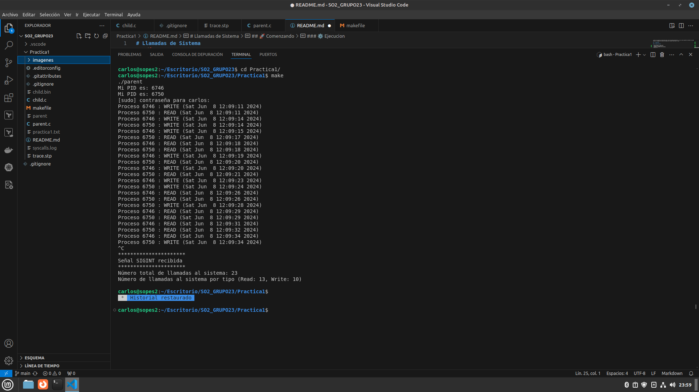
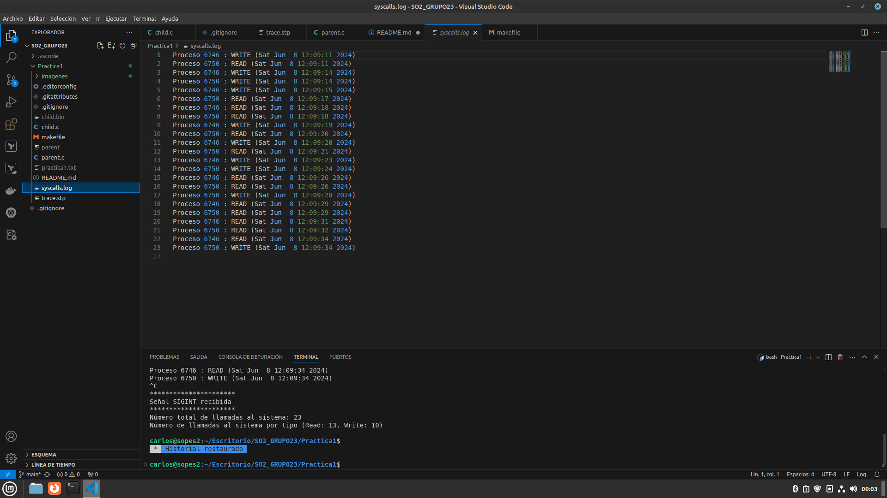

# Llamadas de Sistema

_Este es una practica universitaria del curso de Sistemas Operativos 2, en el cual consiste en escribir un programa que sea capaz de monitorear y almacenar en un log todas las llamadas de sistema realizadas por procesos hijos que se cree_

## 🚀 Comenzando

### 📋 Requerimientos

* Desarrollado en Linux mint
* Lenguaje de programacion C 
* Codigo de respaldo con systemtap
* GCC 11.4.0

    ```console
    gcc --version
    ```
####    Instalacion de herramientas

-   apt update && apt upgrade
-   sudo apt install systemtap
-   sudo apt install gcc

### ⚙️ Ejecucion



